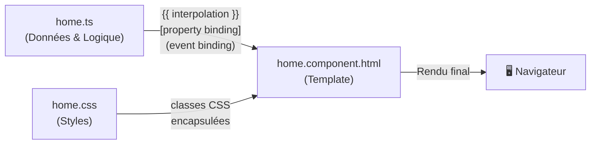
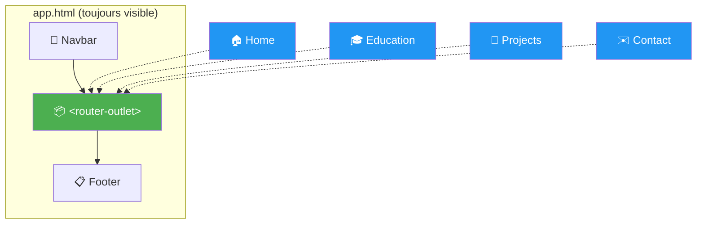
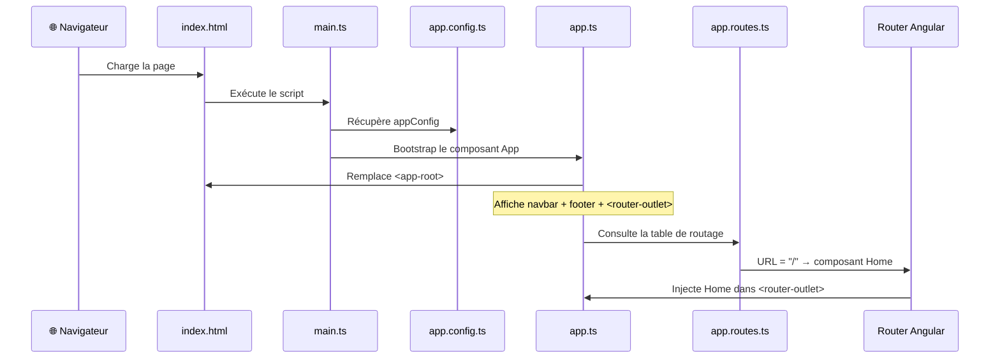
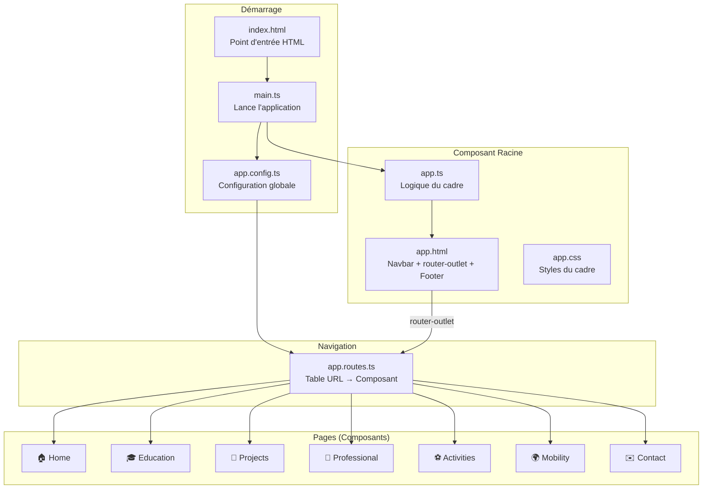

# 🎓 Comprendre Angular à travers ton ePortfolio

> [!NOTE]
> Ce document t'explique, étape par étape, comment fonctionne Angular et comment ton ePortfolio a été architecturé. On part des bases, et on monte progressivement en complexité.

---

## 1. Qu'est-ce qu'Angular ?

Angular est un **framework front-end** développé par Google. Il permet de construire des **Single Page Applications** (SPA), c'est-à-dire des applications web qui ne rechargent jamais la page entière : seul le contenu central change quand tu navigues, ce qui rend l'expérience très fluide.

Angular repose sur trois piliers fondamentaux :
- **TypeScript** (.ts) → la **logique** et les **données** (le cerveau)
- **HTML** (.html) → la **structure** et le **contenu** visuel (le squelette)
- **CSS** (.css) → le **style** et la **mise en forme** (l'apparence)

> [!TIP]
> Pense à Angular comme à un chef de chantier : il **orchestre** la collaboration entre le TypeScript, le HTML et le CSS pour construire chaque pièce (composant) de ta maison (application).

---

## 2. L'architecture en composants

### Le concept clé : le **composant**

En Angular, **tout est composant**. Un composant est une brique autonome et réutilisable de l'interface. Chaque composant est constitué de **trois fichiers** qui travaillent ensemble :

| Fichier | Rôle | Analogie |
|---|---|---|
| `composant.ts` | **Logique** : définit les données, les méthodes, les comportements | Le **cerveau** |
| `composant.html` | **Template** : décrit ce que l'utilisateur voit à l'écran | Le **corps** visible |
| `composant.css` | **Style** : met en forme le template (couleurs, marges, polices…) | Les **vêtements** |

### Les composants de ton ePortfolio

Ton application possède **8 composants**, chacun dans son propre dossier :

```
src/app/
├── app.ts + app.html + app.css          ← Composant racine (le cadre général)
├── home/                                ← Page d'accueil
│   ├── home.ts
│   ├── home.component.html
│   └── home.css
├── education/                           ← Page parcours académique
│   ├── education.ts
│   ├── education.component.html
│   └── education.css
├── projects/                            ← Page projets
│   ├── projects.ts
│   ├── projects.component.html
│   └── projects.css
├── professional/                        ← Page carrière
│   ├── professional.ts
│   ├── professional.component.html
│   └── professional.css
├── activities/                          ← Page activités & loisirs
│   ├── activities.ts
│   ├── activities.component.html
│   └── activities.css
├── mobility/                            ← Page international
│   ├── mobility.ts
│   ├── mobility.component.html
│   └── mobility.css
└── contact/                             ← Page contact
    ├── contact.ts
    ├── contact.component.html
    └── contact.css
```

---

## 3. L'articulation HTML ↔ TypeScript ↔ CSS

C'est **le cœur** du fonctionnement d'Angular. Voyons comment ces trois fichiers dialoguent, avec un exemple concret tiré de ton composant [home.ts](file:///c:/Users/legra/OneDrive/Bureau/N7/Eportfolio/src/app/home/home.ts).

### 3.1. Le fichier TypeScript (`.ts`) : la logique

```typescript
import { Component } from '@angular/core';
import { CommonModule } from '@angular/common';

@Component({
  selector: 'app-home',          // ① Le nom de la balise HTML personnalisée
  standalone: true,               // ② Ce composant est autonome
  imports: [CommonModule],        // ③ Les modules Angular dont il a besoin
  templateUrl: './home.component.html',  // ④ Pointe vers le fichier HTML
  styleUrl: './home.css',                // ⑤ Pointe vers le fichier CSS
})
export class Home {
  // ⑥ Les DONNÉES du composant (propriétés)
  softwareSkills = [
    { name: 'VHDL', img: 'assets/images/VHDL.png' },
    { name: 'Vivado', img: 'assets/images/vivado.png' },
    // ...
  ];
}
```

**Décortiquons chaque élément :**

| Élément | Signification |
|---|---|
| `@Component({...})` | C'est un **décorateur** : il dit à Angular « cette classe est un composant, voici sa configuration » |
| `selector: 'app-home'` | Le **sélecteur CSS** qui crée une balise HTML personnalisée `<app-home>` |
| `standalone: true` | Indique que le composant est **autonome** (il n'a pas besoin d'un `NgModule` parent) |
| `imports: [...]` | Liste des **dépendances** Angular utilisées dans le template (directives, pipes…) |
| `templateUrl` | Le **chemin** vers le fichier HTML associé |
| `styleUrl` | Le **chemin** vers le fichier CSS associé |
| `export class Home` | La **classe TypeScript** qui contient les données et la logique |

### 3.2. Le fichier HTML (`.html`) : le template

Le template utilise une syntaxe HTML enrichie par Angular. Voici un extrait de [home.component.html](file:///c:/Users/legra/OneDrive/Bureau/N7/Eportfolio/src/app/home/home.component.html) :

```html
<div class="skills-grid">
    @for (skill of softwareSkills; track skill.name) {
        <div class="skill-item" [attr.title]="skill.name">
            
            <span class="skill-tooltip">{{ skill.name }}</span>
        </div>
    }
</div>
```

**Les syntaxes spéciales d'Angular :**

| Syntaxe | Nom | Explication |
|---|---|---|
| `{{ skill.name }}` | **Interpolation** | Affiche dynamiquement la valeur d'une variable TypeScript dans le HTML |
| `[src]="skill.img"` | **Property binding** | Lie un attribut HTML à une propriété TypeScript (ici, l'attribut `src` de `` reçoit la valeur de `skill.img`) |
| `@for (item of list; track item.id) { ... }` | **Boucle de flux de contrôle** | Répète un bloc HTML pour chaque élément d'un tableau défini dans le `.ts` |
| `@if (condition) { ... }` | **Condition de flux de contrôle** | Affiche un bloc HTML seulement si la condition est vraie |
| `(click)="toggleExpand(item)"` | **Event binding** | Appelle une méthode TypeScript quand un événement DOM se produit (ici, un clic) |
| `[ngClass]="item.status"` | **Directive NgClass** | Ajoute dynamiquement des classes CSS en fonction d'une valeur TypeScript |

> [!IMPORTANT]
> Le **flux de données** va toujours du `.ts` vers le `.html`. Le TypeScript définit les données, et le HTML les consomme pour construire l'interface. C'est le principe du **data binding** (liaison de données).

### 3.3. Le fichier CSS (`.css`) : le style

Chaque composant a son propre fichier CSS. Angular applique un mécanisme appelé **encapsulation des styles** : les règles CSS d'un composant ne peuvent **pas** affecter un autre composant. Cela évite les conflits de styles entre composants.

```
home.css     → ne stylise QUE le composant Home
education.css → ne stylise QUE le composant Education
app.css      → ne stylise QUE le composant App (navbar, footer)
```

C'est comme si chaque composant vivait dans une bulle de style isolée.

### 3.4. Schéma récapitulatif



---

## 4. Les fichiers fondamentaux de l'application

### 4.1. `app.config.ts` — La configuration de l'application

📄 [app.config.ts](file:///c:/Users/legra/OneDrive/Bureau/N7/Eportfolio/src/app/app.config.ts)

```typescript
import { ApplicationConfig, provideBrowserGlobalErrorListeners } from '@angular/core';
import { provideRouter } from '@angular/router';
import { routes } from './app.routes';

export const appConfig: ApplicationConfig = {
  providers: [
    provideBrowserGlobalErrorListeners(),
    provideRouter(routes)
  ]
};
```

**Rôle** : Ce fichier est le **fichier de configuration central** de l'application. Il définit les **providers** (fournisseurs de services) qui seront disponibles dans toute l'application.

| Provider | Rôle |
|---|---|
| `provideBrowserGlobalErrorListeners()` | Active les **gestionnaires d'erreurs globaux** du navigateur pour capturer les erreurs non gérées |
| `provideRouter(routes)` | Active le **système de routage** en lui passant la table des routes (définie dans `app.routes.ts`) |

> [!TIP]
> Pense à `app.config.ts` comme au **panneau de contrôle** de l'application. C'est ici qu'on branche les grands systèmes (routage, HTTP, authentification…). Si tu voulais ajouter un appel à une API REST, tu ajouterais `provideHttpClient()` dans ce tableau `providers`.

---

### 4.2. `app.routes.ts` — La table de routage

📄 [app.routes.ts](file:///c:/Users/legra/OneDrive/Bureau/N7/Eportfolio/src/app/app.routes.ts)

```typescript
import { Routes } from '@angular/router';
import { Home } from './home/home';
import { Education } from './education/education';
import { Professional } from './professional/professional';
import { Projects } from './projects/projects';
import { Activities } from './activities/activities';
import { Mobility } from './mobility/mobility';
import { Contact } from './contact/contact';

export const routes: Routes = [
  { path: '',             component: Home },
  { path: 'education',    component: Education },
  { path: 'professional', component: Professional },
  { path: 'projects',     component: Projects },
  { path: 'activities',   component: Activities },
  { path: 'mobility',     component: Mobility },
  { path: 'contact',      component: Contact },
  { path: '**',           redirectTo: '' }
];
```

**Rôle** : Ce fichier est le **plan de navigation** de l'application. Il établit la correspondance entre une **URL** dans le navigateur et un **composant** à afficher.

| URL dans le navigateur | Composant affiché |
|---|---|
| `localhost:4200/` | `Home` (page d'accueil) |
| `localhost:4200/education` | `Education` |
| `localhost:4200/professional` | `Professional` |
| `localhost:4200/projects` | `Projects` |
| `localhost:4200/activities` | `Activities` |
| `localhost:4200/mobility` | `Mobility` |
| `localhost:4200/contact` | `Contact` |
| `localhost:4200/nimportequoi` | Redirige vers `Home` (grâce à `**`) |

**Deux choses importantes à noter :**

1. **`path: ''`** → Le chemin vide correspond à la **racine** du site (page d'accueil).
2. **`path: '**'`** → C'est un **wildcard** (joker). Il capture **toutes les URLs inconnues** et redirige l'utilisateur vers la page d'accueil. C'est une page 404 implicite.

> [!IMPORTANT]
> L'ordre des routes compte ! Angular parcourt le tableau de haut en bas et s'arrête à la **première correspondance**. Le wildcard `**` doit donc toujours être **en dernier**, sinon il intercepterait toutes les URLs.

---

### 4.3. `app.ts` — Le composant racine

📄 [app.ts](file:///c:/Users/legra/OneDrive/Bureau/N7/Eportfolio/src/app/app.ts)

```typescript
import { Component, signal } from '@angular/core';
import { RouterOutlet, RouterLink, RouterLinkActive } from '@angular/router';

@Component({
  selector: 'app-root',
  imports: [RouterOutlet, RouterLink, RouterLinkActive],
  templateUrl: './app.html',
  styleUrl: './app.css'
})
export class App {
  protected readonly title = signal('angular-portfolio');
}
```

**Rôle** : C'est le **composant racine**, la coquille externe de toute l'application. Il est le premier composant chargé et il contient tous les autres.

**Points clés :**

| Élément | Explication |
|---|---|
| `selector: 'app-root'` | Ce sélecteur correspond à la balise `<app-root>` dans [index.html](file:///c:/Users/legra/OneDrive/Bureau/N7/Eportfolio/src/index.html). C'est le **point d'ancrage** où Angular injecte toute l'application |
| `RouterOutlet` | Directive qui crée une **zone de rendu dynamique** dans le template (voir section suivante) |
| `RouterLink` | Directive qui transforme un `<a>` en **lien de navigation Angular** (sans rechargement de page) |
| `RouterLinkActive` | Directive qui ajoute automatiquement une **classe CSS** (`active`) au lien correspondant à la route courante |
| `signal('angular-portfolio')` | Un **signal** Angular : une variable réactive. Si elle change, tout ce qui l'utilise se met à jour automatiquement |

---

### 4.4. `app.html` — Le template du composant racine

📄 [app.html](file:///c:/Users/legra/OneDrive/Bureau/N7/Eportfolio/src/app/app.html)

Ce fichier définit la **structure permanente** de l'application : la **navbar** en haut, le **contenu dynamique** au milieu, et le **footer** en bas.

```html
<!-- Navigation (PERMANENTE) -->
<nav class="navbar">
    <div class="nav-container">
        <a routerLink="/" class="nav-logo">Martin Legrand</a>
        <ul class="nav-menu">
            <li><a routerLink="/" routerLinkActive="active"
                   [routerLinkActiveOptions]="{exact: true}"
                   class="nav-link">Home</a></li>
            <li><a routerLink="/education" routerLinkActive="active"
                   class="nav-link">Education</a></li>
            <!-- ... autres liens ... -->
        </ul>
    </div>
</nav>

<!-- CONTENU DYNAMIQUE : ici s'affiche la page courante -->
<main>
  <router-outlet></router-outlet>
</main>

<!-- Footer (PERMANENT) -->
<footer class="footer">
    <!-- ... -->
</footer>
```

**Le concept central : `<router-outlet>`**

C'est la **pièce maîtresse** du routing Angular. C'est un **espace réservé** dans le template où Angular va **injecter dynamiquement** le composant correspondant à l'URL courante.



> Quand tu cliques sur **"Education"** dans la navbar, Angular ne recharge pas la page. Il **remplace** uniquement le contenu à l'intérieur de `<router-outlet>` par le composant `Education`. La navbar et le footer restent en place. C'est le principe de la **Single Page Application**.

**Les directives de routage dans le template :**

| Directive | Exemple | Effet |
|---|---|---|
| `routerLink="/education"` | `<a routerLink="/education">` | Crée un lien Angular qui navigue **sans recharger la page** |
| `routerLinkActive="active"` | `<a routerLinkActive="active">` | Ajoute la classe CSS `active` quand l'URL correspond au lien |
| `[routerLinkActiveOptions]="{exact: true}"` | Sur le lien Home (`/`) | Empêche le lien Home d'être marqué `active` pour toutes les pages (car `/` est un préfixe de toutes les routes) |

---

## 5. Le démarrage de l'application (bootstrap)

Comment tout s'enchaîne au lancement ? Voici la séquence exacte :

### Étape 1 : `index.html` — Le point d'entrée du navigateur

📄 [index.html](file:///c:/Users/legra/OneDrive/Bureau/N7/Eportfolio/src/index.html)

```html
<!doctype html>
<html lang="en">
<head>
  <title>Martin Legrand | E-Portfolio</title>
  <link href="https://fonts.googleapis.com/css2?family=Inter:wght@300;400;500;600;700" rel="stylesheet">
</head>
<body>
  <app-root></app-root>   <!-- ← Angular va injecter l'application ICI -->
</body>
</html>
```

C'est le **seul fichier HTML** que le navigateur charge réellement. La balise `<app-root>` est un **placeholder** vide qu'Angular va remplir.

### Étape 2 : `main.ts` — Le lanceur de l'application

📄 [main.ts](file:///c:/Users/legra/OneDrive/Bureau/N7/Eportfolio/src/main.ts)

```typescript
import { bootstrapApplication } from '@angular/platform-browser';
import { appConfig } from './app/app.config';
import { App } from './app/app';

bootstrapApplication(App, appConfig)
  .catch((err) => console.error(err));
```

Ce fichier exécute la fonction `bootstrapApplication()` qui :
1. Prend le composant `App` (le composant racine)
2. Lui applique la configuration `appConfig` (routage, etc.)
3. Injecte le résultat dans `<app-root>` du `index.html`

### Séquence complète de démarrage



---

## 6. Les pages de ton ePortfolio en détail

### 6.1. 🏠 Home — La page d'accueil

📄 [home.ts](file:///c:/Users/legra/OneDrive/Bureau/N7/Eportfolio/src/app/home/home.ts) | [home.component.html](file:///c:/Users/legra/OneDrive/Bureau/N7/Eportfolio/src/app/home/home.component.html)

**Contenu** : Hero section (photo + titre), section "About Me" avec grille de compétences, et cartes de navigation vers les autres pages.

**Particularités techniques :**
- Utilise `RouterLink` pour les liens de navigation internes (cartes cliquables)
- Utilise `@for` pour itérer sur les tableaux `softwareSkills`, `cvButtons`, et `navigationCards`
- Utilise le **property binding** `[src]="skill.img"` pour afficher dynamiquement les logos

---

### 6.2. 🎓 Education — Le parcours académique

📄 [education.ts](file:///c:/Users/legra/OneDrive/Bureau/N7/Eportfolio/src/app/education/education.ts) | [education.component.html](file:///c:/Users/legra/OneDrive/Bureau/N7/Eportfolio/src/app/education/education.component.html)

**Contenu** : Timeline interactive du parcours académique (CPGE → ENSEEIHT → année de césure).

**Particularités techniques :**
- Chaque entrée de la timeline a une propriété `expanded` (booléen) qui contrôle l'ouverture/fermeture
- La méthode `toggleExpand(item)` inverse la valeur de `expanded` au clic → c'est un **event binding** `(click)="toggleExpand(item)"`
- Utilise `[ngClass]` pour appliquer dynamiquement des classes CSS selon le `status` (completed, current, upcoming)
- Les boucles imbriquées `@for` dans `@if` permettent d'afficher conditionnellement les détails

---

### 6.3. 🔧 Projects — Les projets techniques

📄 [projects.ts](file:///c:/Users/legra/OneDrive/Bureau/N7/Eportfolio/src/app/projects/projects.ts)

**Contenu** : Présentation détaillée de 6 projets (FPGA, optoélectronique, RFID, IoT, stage SERMA…).

**Particularités techniques :**
- Structure de données riche et hiérarchique : chaque projet contient des `columns` (elles-mêmes contenant des `tasks`) et des `tags`
- Trois niveaux de boucles `@for` imbriquées : projets → colonnes → tâches

---

### 6.4. 💼 Professional — Le projet professionnel

📄 [professional.ts](file:///c:/Users/legra/OneDrive/Bureau/N7/Eportfolio/src/app/professional/professional.ts)

**Contenu** : Objectifs de carrière (court/moyen/long terme), expériences professionnelles, centres d'intérêt techniques.

**Particularités techniques :**
- Même pattern d'expansion que Education (`toggleGoal()`)
- Les détails utilisent un objet structuré `{ label, text }` au lieu de simples chaînes de caractères

---

### 6.5. ⚽ Activities — Activités et loisirs

📄 [activities.ts](file:///c:/Users/legra/OneDrive/Bureau/N7/Eportfolio/src/app/activities/activities.ts)

**Contenu** : Engagements associatifs (Foyer, N7etMat), passions sportives (course, handball), soft skills.

**Particularités techniques :**
- Trois tableaux de données distincts (`involvements`, `passions`, `skills`) affichés dans des sections séparées
- Les icônes SVG sont stockées sous forme de chaînes `path` dans le TypeScript et injectées dans le HTML via `[attr.d]="card.icon"`

---

### 6.6. 🌍 Mobility — Profil international

📄 [mobility.ts](file:///c:/Users/legra/OneDrive/Bureau/N7/Eportfolio/src/app/mobility/mobility.ts)

**Contenu** : Compétences PCE (Professional Communication in English), langues, objectifs internationaux.

---

### 6.7. ✉️ Contact — Formulaire de contact

📄 [contact.ts](file:///c:/Users/legra/OneDrive/Bureau/N7/Eportfolio/src/app/contact/contact.ts)

**Contenu** : Formulaire de contact fonctionnel envoyant les messages via Formspree.

**Particularités techniques :**
- Utilise `ReactiveFormsModule` et `FormBuilder` pour créer un **formulaire réactif** Angular
- Les `Validators` appliquent des règles de validation (champ requis, format email, longueur minimale)
- La méthode `onSubmit()` est **asynchrone** (`async/await`) et envoie les données à l'API Formspree via `fetch()`
- Gestion des états : `isSubmitting` (envoi en cours), `isSuccess` (succès), `errorMessage` (erreur)

---

## 7. Récapitulatif : le rôle de chaque fichier clé



| Fichier | Rôle en une phrase |
|---|---|
| [index.html](file:///c:/Users/legra/OneDrive/Bureau/N7/Eportfolio/src/index.html) | La **page HTML unique** chargée par le navigateur, contient `<app-root>` |
| [main.ts](file:///c:/Users/legra/OneDrive/Bureau/N7/Eportfolio/src/main.ts) | Le **lanceur** qui démarre Angular avec le composant racine et la config |
| [app.config.ts](file:///c:/Users/legra/OneDrive/Bureau/N7/Eportfolio/src/app/app.config.ts) | Le **panneau de configuration** : active le routage et les services globaux |
| [app.routes.ts](file:///c:/Users/legra/OneDrive/Bureau/N7/Eportfolio/src/app/app.routes.ts) | Le **plan de navigation** : associe chaque URL à un composant |
| [app.ts](file:///c:/Users/legra/OneDrive/Bureau/N7/Eportfolio/src/app/app.ts) | Le **composant racine** : le cadre qui contient la navbar, le footer, et le `<router-outlet>` |
| [app.html](file:///c:/Users/legra/OneDrive/Bureau/N7/Eportfolio/src/app/app.html) | Le **template racine** : définit la structure permanente (navbar + zone dynamique + footer) |

---

## 8. Glossaire des termes Angular

| Terme | Définition |
|---|---|
| **Composant** | Brique autonome de l'UI, composée d'un `.ts`, `.html`, et `.css` |
| **Décorateur** | Annotation `@Component({...})` qui configure une classe TypeScript comme composant Angular |
| **Template** | Le fichier HTML d'un composant, enrichi de syntaxes Angular |
| **Interpolation** | `{{ variable }}` — affiche une valeur TypeScript dans le HTML |
| **Property Binding** | `[attribut]="expression"` — lie un attribut HTML à une valeur TypeScript |
| **Event Binding** | `(event)="methode()"` — appelle une méthode TypeScript lors d'un événement DOM |
| **Directive** | Instruction qui modifie le comportement ou l'apparence d'un élément HTML (`ngClass`, `RouterLink`…) |
| **Router** | Le système de navigation d'Angular, qui gère les changements d'URL sans recharger la page |
| **Router Outlet** | Le placeholder `<router-outlet>` où Angular injecte dynamiquement les composants selon l'URL |
| **Signal** | Variable réactive Angular : quand sa valeur change, l'UI se met à jour automatiquement |
| **Provider** | Un service ou une fonctionnalité injectée globalement via `app.config.ts` |
| **Standalone** | Un composant qui ne dépend pas d'un `NgModule`, il déclare ses propres imports |
| **SPA** | Single Page Application — application web qui ne recharge jamais la page entière |
| **Wildcard (`**`)** | Route qui capture toutes les URLs non définies (équivalent d'une page 404) |
| **Formulaire réactif** | Formulaire géré programmatiquement via `FormBuilder` et `FormGroup`, avec validation intégrée |
